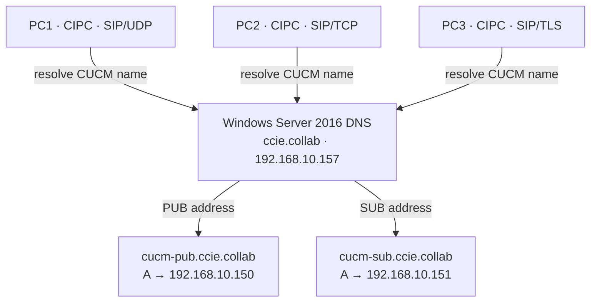

# DNS A Records: From a CUCM Name to a SIP Destination



## Why an A record matters in a SIP network

An **A record maps a hostname to an IPv4 address**. It answers “What IPv4 address belongs to `cucm-pub.ccie.collab`?” It does **not** specify whether to use SIP/UDP, SIP/TCP, or SIP/TLS, and it does not supply port 5060 or 5061. Those decisions come from the client’s configuration or, for clients using service discovery, other DNS records such as SRV. [RFC 1035](https://www.rfc-editor.org/rfc/rfc1035) defines an A record’s address data as a 32-bit Internet address.

Names let a collaboration configuration refer to a server without embedding its IPv4 address everywhere. Correct A records are also necessary for an SRV-aware client to turn an SRV **target hostname** into an address it can contact. An A record alone provides neither SRV priority nor automatic PUB-to-SUB failover.

## Our Windows Server 2016 DNS records

| DNS zone | Host name | Resulting FQDN | IPv4 address |
|---|---|---|---|
| `ccie.collab` | `cucm-pub` | `cucm-pub.ccie.collab` | `192.168.10.150` |
| `ccie.collab` | `cucm-sub` | `cucm-sub.ccie.collab` | `192.168.10.151` |

Windows Server at `192.168.10.157` hosts this DNS zone. The two CUCM nodes are separate hosts, so each has its own A record.

## Inspect or create the records in Windows Server 2016

Open **Server Manager → Tools → DNS → Forward Lookup Zones → ccie.collab**. Look for the `cucm-pub` and `cucm-sub` **Host (A)** records. Confirm their IPv4 addresses against the table.

If building this lab from scratch and a record is absent, right-click **ccie.collab → New Host (A or AAAA)**, enter the short host name and IPv4 address, then select **Add Host**. Repeat for the other node. **If the correct record is already present, leave it in place.** Microsoft documents both the [DNS Manager and PowerShell methods](https://learn.microsoft.com/en-us/windows-server/networking/dns/manage-resource-records) for managing host records.

An administrator building a *new* zone could also use:

```powershell
Add-DnsServerResourceRecordA -ZoneName 'ccie.collab' `
    -Name 'cucm-pub' -IPv4Address '192.168.10.150'

Add-DnsServerResourceRecordA -ZoneName 'ccie.collab' `
    -Name 'cucm-sub' -IPv4Address '192.168.10.151'
```

**These are creation commands, not commands to rerun against our working zone.**

## Verify on Windows Server 2016 first

Inspect the records stored in the authoritative zone:

```powershell
'cucm-pub','cucm-sub' | ForEach-Object {
    Get-DnsServerResourceRecord -ZoneName 'ccie.collab' `
        -Name $_ -RRType A |
        Select-Object HostName, RecordType, RecordData, TimeToLive
}
```

Then ask the DNS service for its answers:

```powershell
Resolve-DnsName cucm-pub.ccie.collab -Type A `
    -Server 192.168.10.157 -DnsOnly

Resolve-DnsName cucm-sub.ccie.collab -Type A `
    -Server 192.168.10.157 -DnsOnly
```

Expect PUB `.150` and SUB `.151`. `TimeToLive` describes how long a DNS answer can be cached; a cached answer can delay visibility of a subsequent address change. See [RFC 8767](https://www.rfc-editor.org/rfc/rfc8767).

## Verify from PC1, PC2, and PC3

Run on **each** Windows PC:

```powershell
Resolve-DnsName cucm-pub.ccie.collab -Type A `
    -Server 192.168.10.157 -DnsOnly

Resolve-DnsName cucm-sub.ccie.collab -Type A `
    -Server 192.168.10.157 -DnsOnly
```

Or from Command Prompt:

```cmd
nslookup cucm-pub.ccie.collab 192.168.10.157
nslookup cucm-sub.ccie.collab 192.168.10.157
```

All three PCs should get the same two IPv4 mappings. This proves **DNS resolution**, not that all three CIPC instances use the same SIP transport or that they have registered successfully.

## Packet-level story: PC1 SIP over UDP

Start Wireshark on PC1’s active Ethernet adapter before launching CIPC:

```wireshark
dns.qry.type == 1 && ip.addr == 192.168.10.157
```

DNS query type **1** is A. In our PC1 capture:

| Packet | Observation | Meaning |
|---|---|---|
| `70–71` | PC1 asks for `CUCM-PUB.CCIE.COLLAB`; DNS answers `192.168.10.150` | The PUB hostname resolves to its IPv4 address. |
| `247–248` | PC1 asks for `CUCM-SUB.CCIE.COLLAB`; DNS answers `192.168.10.151` | The SUB hostname resolves to its IPv4 address. |
| `262–264` | PC1 sends SIP/UDP REGISTER to PUB `192.168.10.150:5060`; PUB replies `100 Trying`, then `200 OK` | Successful active registration with PUB. |

**Sequence detail:** CIPC had already contacted its manually configured PUB TFTP address and fetched configuration earlier in this capture. The A lookup did **not** discover that initial TFTP address. The observed A lookups resolved CUCM hostnames; this capture did not show a SIP SRV lookup choosing PUB.

To examine both the name resolution and the registration:

```wireshark
(dns.qry.type == 1 && ip.addr == 192.168.10.157) ||
(ip.addr == 192.168.20.50 && udp.port == 5060)
```

An A answer is a **DNS packet**. The later REGISTER and `200 OK` are **SIP packets**. Correlate their timestamps and addresses; do not treat a successful DNS answer as proof of registration.

## How A and SRV work together

For a client that actually uses SIP SRV discovery:

1. **SRV** `_sip._udp.ccie.collab` can return `cucm-pub.ccie.collab`, priority 10, port 5060.
2. **A** `cucm-pub.ccie.collab` returns `192.168.10.150`.
3. The client can send SIP/UDP to `192.168.10.150:5060`.

The same principle applies to the TCP and TLS SRV targets. [RFC 3263](https://www.rfc-editor.org/rfc/rfc3263) describes the SIP server-location path through SRV and A/AAAA, as well as cases where a client goes directly to an address or an A/AAAA lookup. **Our PC1 CIPC capture demonstrated A lookups, but no SRV lookup.**

## References

- [Microsoft Learn — Manage DNS resource records](https://learn.microsoft.com/en-us/windows-server/networking/dns/manage-resource-records)
- [RFC 1035 — Domain names: implementation and specification](https://www.rfc-editor.org/rfc/rfc1035)
- [RFC 3263 — SIP: Locating SIP Servers](https://www.rfc-editor.org/rfc/rfc3263)
